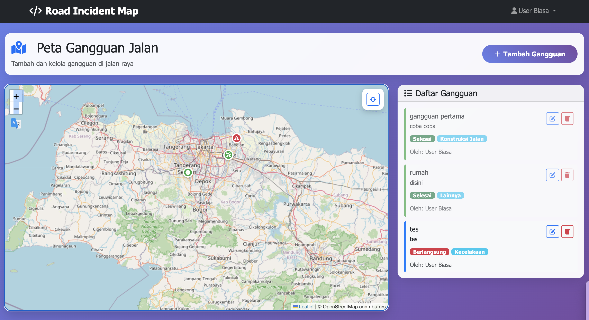

# Road Incident Map

Road Incident Map is a modern web application for reporting, mapping, and managing road disturbances/incidents in real time. Built with Laravel and Bootstrap, it provides an interactive map and user-friendly dashboard for both the public and administrators.

## Features

- **Interactive Map**: Visualize all reported road incidents on a map using Leaflet and OpenStreetMap.
- **Incident Reporting**: Users can report new road disturbances (accidents, traffic jams, road construction, floods, etc.) with title, description, type, and precise location (latitude & longitude).
- **Coordinate Selection**: Select location by clicking on the map or entering coordinates manually.
- **Incident List**: View a list of all reported incidents, filter by status (ongoing/resolved), and see details for each report.
- **Status Management**: Update the status of incidents (ongoing/resolved). Only the reporter or admin can update or delete a report.
- **User Authentication**: Register, login, and logout with role-based access (admin/user).
- **Admin Dashboard**: Admins can view and manage all reports, while users can only manage their own.
- **Responsive Design**: Optimized for desktop and mobile devices.

## Project Structure
- **Backend**: Laravel 7, Eloquent ORM, RESTful controllers
- **Frontend**: Blade templates, Bootstrap 5, Leaflet.js
- **Database**: MySQL (or compatible), with migrations for users, roles, and disturbances

## How It Works
1. **User Registration & Login**: Users create an account and log in to access the dashboard and map features.
2. **Reporting an Incident**: On the map page, users can add a new incident by filling out a form and selecting the location.
3. **Managing Incidents**: Users can edit or delete their own reports. Admins have full control over all reports.
4. **Viewing on Map**: All incidents are displayed as markers on the map, color-coded by status and type.

## Installation
1. Clone this repository.
2. Run `composer install` to install PHP dependencies.
3. Copy `.env.example` to `.env` and set your database credentials.
4. Run `php artisan key:generate`.
5. Run migrations: `php artisan migrate --seed` (to create tables and seed roles/users).
6. Start the development server: `php artisan serve`.

## Default Roles & Access
- **Admin**: Can manage all incidents and users.
- **User**: Can report and manage their own incidents.

## Technologies Used
- Laravel 7
- Bootstrap 5
- Leaflet.js
- MySQL
- Spatie Laravel Permission (for roles)

## License
This project is open-sourced under the MIT license.
